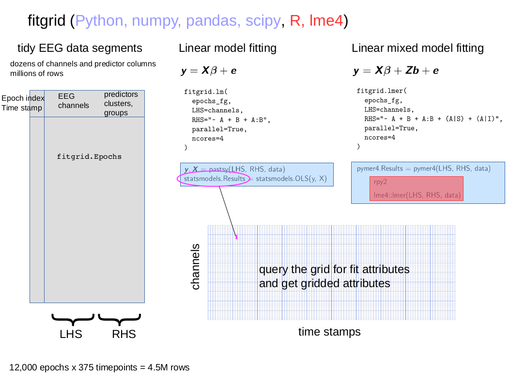

#########
`fitgrid`
#########

`fitgrid` is a Python package originally designed to streamline the
computation and interpretation of regression ERPs (rERPs) as described
by Smith and Kutas ([SmiKut2015a]_). That report articulates the
conceptual foundation of rERPs as time-series of estimated regression
variable coefficients, :math:`\hat{\beta}_i`, for linear models of the
form :math:`\beta_0 + \beta_1 X_1 + \ldots + \beta_n X_n + e` and
their role in modeling EEG and similar event-related time-series data.

The `fitgrid` package exposes the multichannel time-series modeling
computations via an API that uses the standard ordinary least squares
and mixed effects regression modeling formulas of Python (`patsy`,
`statsmodels.formula.api`) and R (`lm`, `lme4::lme4`, `lmerTest`) and
returns the results as tidy dataframes so that researchers can conduct
this type of modeling easily, efficiently, informatively, and
reproducibly with familiar tools in scripted data analysis workflows.

For a summary of the problem `fitgrid` solves, why it is worth
solving, and how it is solved, see the :ref:`why_fitgrid`. The
:ref:`getting_started` section outlines and illustrates the `fitgrid`
analysis workflow with executable examples. The :ref:`user_guide`
provides additional information about specific topics. The
:ref:`examples_gallery` contains executable vignettes using `fitgrid`
with experimental EEG recordings and NOAA tide and atmospheric
observations that may be downloaded as Python scripts or Jupyter
notebooks. The :ref:`api` is a complete listing of `fitgrid` classes,
methods, and functions.

.. toctree::
    :hidden:
    :glob:

    why_fitgrid
    installation
    auto_gallery/getting_started
    user_guide
    gallery
    api
    bibliography

