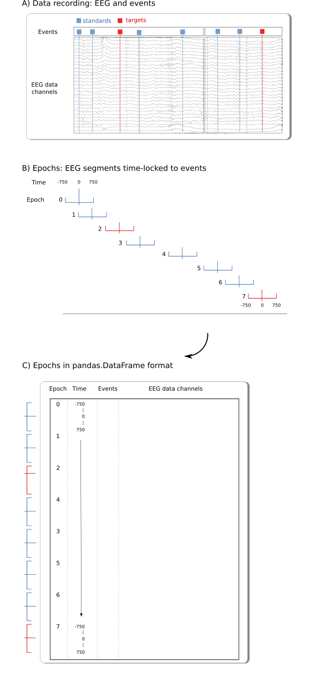

.. _user_guide:

.. module:: fitgrid
   :noindex:

##########
User Guide
##########

TL;DR These are notes and highlights. For usage see
the :ref:`workflow`, :ref:`gallery`, and :ref:`api`

================
`fitgrid.Epochs`
================

Fitting linear regression models in Python and R with formulas like `y
~ a + b + a:b` in Python (`patsy`, `statsmodels.formula.api`) or R (`lm`,
`lme4::lmer`) assumes the data are represented as a 2D array with the
variables in named columns, `y`, `a`, `b` and values ("observations",
"scores") in rows.

`fitgrid` follows this format with the additional assumption that the
data are vertically stacked fixed-length time-series "epochs", so the
user must specify two additional columns of values that together
uniquely identify the epoch and time of the data row. 

.. _epochs_data_format:

------
Format
------

**Specification:** Data for `fitgrid` modeling should be prepared as a single
`pandas.Dataframe` with these columns and data types:

- `epoch_id`: integer
- `time`: integer
- a set of channel data columns: numeric
- a set of predictor variable columns: numeric, string, boolean

Each epoch must have a unique integer identifier in the `epoch_id`
column. Gaps are OK, duplicates are not.

The integer time-stamps must be the same for all epochs.
Gaps are OK, duplicates are not.

Column names may be chosen freely (epoch and time index column
names default to `epoch_id`, `time`).

**Notes:** The index column names default to `epoch_id` and `time` but
any column may be designated as the epoch or time index, provided
the conditions are met. Standard practice is to sequence the rows so
time stamps are nested within epochs. Event-relative epochs are
generally time-stamped so the event is at time=0 but this is not a
`fitgrid` requirement.

**Example:** A canonical source of data epochs for `fitgrid` are
multichannel "strip charts" as in EEG and MEG recordings. In this
case, "epochs" are fixed-length segments extracted from the strip
chart and time-stamped relative to an experimental event.

--------------------------------------
:ref:`Data Ingestion <data_ingestion>`
--------------------------------------

Rows and columns epochs data can be loaded into a `fitgrid.Epochs`
object from a `pandas.DataFrame` in memory or read from files in
feather or HDF5 format. 

For details on these data formats see `pandas.read_feather
<https://pandas.pydata.org/pandas-docs/stable/reference/api/pandas.read_feather.html>`_
and `pandas.read_hdf
<https://pandas.pydata.org/pandas-docs/stable/reference/api/pandas.read_hdf.html>`_).

-----------------------------------------
:ref:`Data Simulation <data_simulation>`.
-----------------------------------------

``fitgrid`` has a built-in function that generates data and creates ``Epochs`` data for testing.

===============
Fitting a model
===============

The following methods populate the `FitGrid[time, channel]` object.
with `statsmodels` results for OLS model fits and `lme4::lmer` for
linear mixed-effects fits. 

* Ordinary least squares: :py:meth:`fitgrid.lm`

  .. code-block:: python

     lm_grid = fitgrid.lm(
         epochs_fg,
         RHS='1 + categorical + continuous'
     )

* Linear mixed-effects: :py:meth:`fitgrid.lmer`

  .. code-block:: python

     lmer_grid = fitgrid.lmer(
         epochs_fg,
         RHS='1 + continuous + (continuous | categorical)'
     )

* User-defined (experimental): :py:meth:`fitgrid.run_model`

============================
The `FitGrid[time, channel]`
============================

--------------------------
Slice by `time`, `channel`
--------------------------

 
Slice the `FitGrid` with `pandas.DataFrame` range ``:`` and label slicers.
The range includes the upper bound.

.. code-block:: python

   lm_grid[:, ["MiCe", "MiPa"]]
   lm_grid[-100:300, :]
   lm_grid[0, "MiPa"]

--------------
Access results
--------------

Query the `FitGrid` results like a single fit object. Result grids are
returned as as `pandas.DataFrame` or another `FitGrid` which can be
queried the same way.

.. code-block:: python

   lmg_grid.params
   lmg_grid.llf

----------------
Slice and access
----------------

.. code-block:: python

   lm_grid[-100:300, ["MiCe", "MiPa"].params

---------------------
``LMFitGrid`` methods
---------------------

The fitted OLS grid provides time-series plots of selected model
results: estimated coefficients :py:meth:`fitgrid.lm.plot_betas` and
adjusted :math:`R^2` :py:meth:`fitgrid.lm.plot_adj_rsquared` (see also
:py:meth:`fitgrid.utils` for additional model summary wrappers).

========================
Saving and loading grids
========================

Running models on large datasets can take a long time. `fitgrid` lets
you save your grid to disk so you can restore them later without
having to refit the models. However, saving and loading large grids
may still be slow and generate very large files.

Suppose you run `lmer` like so::

    grid = fitgrid.lmer(epochs, RHS='x + (x|a)')

Save the ``grid``::

    grid.save('lmer_results')

Later you can reload the ``grid``::

    grid = fitgrid.load_grid('lmer_results')

.. warning::

   Fitted grids are saved and loaded with Python `pickle` which is not
   guaranteed to be portable across different versions of Python.
   Unpickling unknown files **is not secure** (for details see the
   Python `docs
   <https://docs.python.org/3/library/pickle.html>`_). Only load grids
   you trust such as those you saved yourself. For reproducibility and
   portability fit the grid, collect the results you need, and export
   the dataframe to a standard data interchange format.

.. _guide_summaries:

===============================
Model comparisons and summaries
===============================

To reduce memory demands when comparing sets of models, `fitgrid`
provides a convenience wrapper, `fitgrid.utils.summarize`, that
iteratively fits a list of models and collects a lightweight summary
dataframe with key results for model interpretation and
comparison. Unlike the primary `FitGrid`, the summary dataframe format
is the same for `fitgrid.lm` and `fitgrid.lmer`. Some helper functions
are available for visualizing selected summary results.

.. _diagnostics:

================================
Model and data diagnostics (WIP)
================================

Model and data diagnostics in the `fitgrid` framework is work in
progress. For ordinary least squares fitting, there is some support
for the native `statsmodels` OLS diagnostic measures.  Diagostics that
can be computed analytically from a single model fit, e.g., via the
hat matrix diagonal, may be useable but many are not for realistically
large data sets. The per-observation diagnostic measures, e.g., the
influence of observations on estimated parameters, are the same size
as the original data multiplied by the number of model parameters
which may overload memory and measures that require on
leave-one-observation-out model refitting take intractably long for
large data sets. A minimal effort is made to guard the user from known
trouble but the general policy is `fitgrid` stays out of the way
so you can try what you want. If it works great, if it chokes, that's
the nature of the beast you are modeling.

Support for linear-mixed effects diagnostics in `fitgrid` is limited
to a variance inflation factor computation implemented in Python as a
proof-of-concept. `fitgrid` does not interface with mixed-effect model
diagnostics libraries in R and plans are to improve
support for mixed-effects modeling in Python rather than expand further
into the R ecosystem.

========================
`fitgrid` under the hood
========================

--------------------------------
How mixed effects models are run
--------------------------------

Mixed effects models do not have a complete implementation in Python, so we
interface with R from Python and use `lme4` in R. The results that you get when
fitting mixed effects models in `fitgrid` are the same as if you used `lme4`
directly, because we use `lme4` (indirectly).

-----------------------
Multicore model fitting
-----------------------

On a multicore machine, it may be possible to significantly speed 
fitting by computing the models in parallel. ``fitgrid.lm`` uses
``statsmodels`` under the hood to fit a linear least squares model,
which in turn employs ``numpy`` for calculations.  ``numpy`` itself
depends on linear algebra libraries that might be configured to use
multiple threads by default. This means that on a 48 core machine,
common linear algebra calculations might use 24 cores automatically,
without any explicit parallelization. So when you explicitly
parallelize your calculations using Python processes (say 4 of them),
each process might start 24 threads. In this situation, 96 CPU bound
threads are wrestling each other for time on the 48 core CPU. This is
called oversubscription and results in *slower* computations.

To deal with this when running ``fitgrid.lm``, we try to instruct the
linear algebra libraries your ``numpy`` distribution depends on to
only use a single thread in every computation. This then lets you
control the number of CPU cores being used by setting the ``n_cores``
parameter in :py:meth:`fitgrid.lm` and :py:meth:`fitgrid.lmer`. 

If you are using your own 8-core laptop, you might want to use all
cores, so set something like ``n_cores=7``. On a shared machine, it's
a good idea to run on half or 3/4 of the cores if no one else is
running heavy computations. 

Note that fitgrid parallel processing counts the "logical" cores
available to the operating system and this may differ from the number
of physical cores, depending on the system hardware and setting, e.g.,
Intel CPUs with hyperthreading enabled. The Python package
`psutil <https://psutil.readthedocs.io/en/latest/>`_ and
``psutil.cpu_count(logical=True)`` and
``psutil.cpu_count(logical=False)`` may be useful for interrogating
the system about the available resources.
