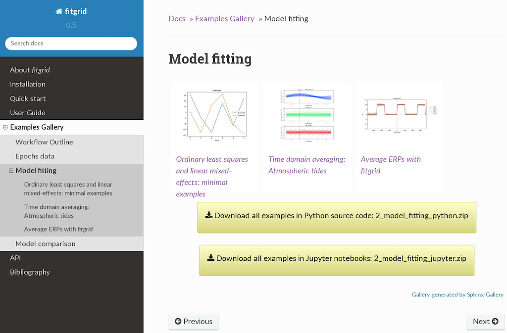

# Summary

Electrical brain activity related to external stimulation and internal
mental events can be measured at the scalp as tiny time-varying
electrical potential waveforms (EEG), typically a few tens of
microvolts peak to peak [@Berger1930]. Even tinier brain responses,
too small to be seen by naked eye in the EEG, can be detected by
repeating the stimulation, aligning the EEG recordings to the
triggering event and averaging them at each time point
[@Dawson1951; @Dawson1954]. Under assumptions that the brain response
(signal) is the same in each recording and the ongoing background EEG
(noise) varies randomly, averaging improves the estimate of the "true"
brain response at each time point as the random variation cancels. The
average event-related brain potential (ERP) and its counterpart for
event-related magnetic fields (ERFs) are cornerstones of experimental
brain research in human sensation, perception, and cognition
[@LucKap2013].

Smith and Kutas pointed out that the average ERP at each time $t$ is
mathematically identical to the estimated constant
$\hat{\beta}_{0}(t)$ for the regression model $y(t) = \beta_{0}(t) +
\varepsilon(t)$, fit by minimizing squared error [@SmiKut2015]. The
average ERP can be viewed as a time series of model parameter
estimates. Generalizing to more complex models, e.g., multiple
regression $y(t) = \beta_{0} + \beta_{1}X_{1} + \ldots +
\beta_{p}X_{p} + \varepsilon$, likewise produces time series of
estimates for the constant and each regressor coefficient, the
$\hat{\beta}_{0}(t), \hat{\beta}_{1}(t), \ldots, \hat{\beta}_{p}(t)$
dubbed regression ERP (rERP) waveforms
[see @SmiKut2015; @SmiKut2015b for discussion of related approaches].
This holds for straight-line fits ("slope" rERPs) as well as models of
curvilinear relationships, e.g., spline regression
[@SmiKut2015b]. Besides the estimated coefficient rERPs, the approach
also produces time series for all the basic and derived quantities of
the fitted model: coefficient standard errors, residuals, residual
error, likelihood, Akaike information criterion (AIC), and so
forth. With the shift from averaging to regression modeling, however,
comes a new problem.

# Statement of need

Interpreting recordings of brain responses and drawing inferences from
patterns of systematic variation is based on statistical comparison and
evaluation of candidate models.  Whereas fitting a regression model is
straightforward on current scientific computing platforms, informative
modeling, by contrast, is a laborious process that iterates cycles of
data quality control, fitting, data diagnosis, model evaluation,
comparison, selection, and interpretation with numerous decision
points that require thought and judgment.

Modeling digitized multichannel EEG data as regression ERPs at each
time point and data channel multiplies the iterative cycles in a
combinatorial explosion of times $\times$ channels $\times$ models
$\times$ comparisons. For instance, at a digital sampling rate of 250
samples per second, in 3 seconds of 32-channel EEG data there are
24,000 data sets (= 3 $\times$ 250 $\times$ 32). To fit a set of three
candidate models requires 72,000 separate model fits, where the size
of each data set might range anywhere from a few dozens of
observations for a single subject to tens of thousands of observations
for a large scale experiment. The combinatorial explosion is
unavoidable; `fitgrid` contains it.

The rERP approach is attracting growing attention in the field but to
date the open-source EEG and MEG data analysis landscape has been
dominated by toolboxes written for MATLAB such as EEGLAB
[@DelMak2004], FieldTrip [@OosEtAl2011], and Brainstorm
[@TadEtAl2011], and this holds for rERP modeling, e.g., @EhiDim2019.
Like open-source scientific computing generally, Python and R have
been gaining traction for EEG and MEG analysis, as in MNE Python
@GramfortEtAl2013 and for regression ERPs in R,
@TreNew2015. Nevertheless, widely accessible implementations for rERP
modeling in the Python remain limited.  Development of N. J. Smith's
promising rERPy Python package for ERP and rERP analysis appears to
have halted in Python 2.X. MNE Python implements a `linear_regression`
function for computing rERP coefficients on continuous data as
described in @SmiKut2015b but not time series of OLS or mixed-effects
model fits. `fitgrid` is intended to fill this gap in the Python
ecosystem.


# fitgrid

`fitgrid` makes the rERP modeling described in @SmiKut2015 accessible
to researchers with a working knowledge of scripted data analysis in
Python and the symbolic formulae such as $\mathsf{\sim 1 + a + b +
a:b}$ and $\mathsf{\sim 1 + a*b + (a|s) + (a|i) }$ currently in wide
use to specify ordinary and mixed-effects models in Python and R
[`patsy` @patsy; `lme4::lmer` @BatesEtAl2015; `lm` @Rproject].

The `fitgrid` user interface launches what are routinely hundreds to
tens of thousands of model fits with one line of code (computed in
parallel if supported by hardware). The fit results across times and
channels are available on demand with the same syntax used to access
results in a single fit object and the results are returned as tidy
indexed `pandas.DataFrames` for further analysis, visualization, and
interpretation. 

`fitgrid` provides routines for generating simulated data and
downloading sample EEG data from a public Zenodo companion archive
[@mkpy_data_examples_003]. The documentation includes executable
Python vignettes that illustrate their use. While the origins of
`fitgrid` are in EEG data analysis, `fitgrid` can also be used with
other neuroimaging data such as MEG and more generally with
synchronized sensor array time-series data from other domains for
which event-related regression modeling is appropriate.  `fitgrid`
enables researchers to conduct this type of computationally-intensive
modeling flexibly, efficiently, informatively, and reproducibly with
familiar scientific computing tools and minimal programming. These
features make `fitgrid` well-suited for general use in exploratory
data analysis (EDA), e.g., @UrbDelChaKut2020 and @TroUrbKut2020.


# Documentation

The `fitgrid` documentation is available online:
[https://kutaslab.github.io/fitgrid]([https://kutaslab.github.io/fitgrid]).

* [Getting Started]() gives an overview of the `fitgrid` workflow with
   notes, figures, and downloadable and executable code.
   
* The [User Guide]() provides information about usage and specific
  topics including how the OLS models are fit in Python `statsmodels`
  [@SeaPer2010] and the LMER models are fit in R
  [`lme4::lmer`, `lmerTest` @KuzBroChr2017] via `pymer4` [@Jolly2018].

* The [API Reference]() is a complete listing of `fitgrid` classes,
  methods, attributes, and functions auto-generated with numpy-style
  docstrings and links to the source code generated by
  ``sphinx-apidoc`` [@sphinx].

* The [Bibliography]() includes references to relevant experimental
  and technical literature.

* The [Examples Gallery]() contains `fitgrid` vignettes with simulated
  data, experimental EEG recordings, and NOAA tide and atmospheric
  observations that can be downloaded as executable Python scripts or
  Jupyter notebooks thanks to
  [sphinx-gallery](https://sphinx-gallery.github.io/).

  

## Installation, Continuous Integration, and Source 

The online documentation includes [installation instructions]() and
system recommendations.  The latest stable release of `fitgrid` and
the bleeding edge pre-release development version are packaged for
Python 3.6, 3.7, and 3.8 on x86_64 linux and distributed on Anaconda
Cloud. Installation of the stable release into a fresh conda virtual
environment along with other compatible packages, e.g., `jupyter` for
running Example Gallery notebooks, is recommended like so:

```bash
    $ conda create --name fg_env \
        -c kutaslab -c defaults -c conda-forge \
	    fitgrid jupyter
```

`fitgrid` is developed and tested locally on a high-performance
48-core x86_64 CentOS 7 server. Continuous integration (CI) with
github Actions for the latest stable release on the main code branch
runs nightly conda build, conda install, and package pytests on
Ubuntu 18.04. Pre-release packages also pass CI conda build, conda
install, and pytests before deployment to Anaconda Cloud. The
Python 3.6, 3.7 and 3.8 64-bit Intel OSX and Windows packages are also
distributed on Anaconda Conda and the Python sdist is uploaded to PyPI
but these are not routinely tested (contributed field reports are
welcome). The source code is hosted in the public github repository
[https://github.com/kutaslab/fitgrid)](https://github.com/kutaslab/fitgrid)
and Issues may be posted there in accordance with the `fitgrid` Code
of Conduct.


## Implementation
The core function of `fitgrid` is to apply a linear regression or a
linear mixed effects model to datasets encapsulated in an input
`Epochs` object. The output is a `FitGrid` which maintains a 2D grid
of fit objects, each representing the results of fitting the model on
the dataset associated with the grid point.

The `FitGrid` object exposes the same attributes and methods that the
individual fit objects provide. Attribute accesses and method calls
are broadcast to each cell in the grid with results returned in a form
that mirrors the shape of the original grid, eliminating the need for
explicit iteration over the elements. NumPy array slicing syntax is
supported for indexing on the grid dimensions (time and channels when
applied to EEG data). This functionality is achieved by implementing
some of Python's special methods like `__getitem__`, `__getattr__`,
`__call__`, `__dir__` in the `FitGrid` class.

As a result, the cognitive load on the researcher is lightened since
the familiar interfaces of a fit object (used to examine model fit
characteristics) and of a 2D NumPy array (used to index on the space
and time dimensions) are combined in a single entity.

When multiple model formulations are used, the resulting `FitGrid`
objects can be used to compare goodness of fit measures and carry out
mass model comparison and selection. This is one of the main
applications enabled by the framework described in this section.

## Limitations

In addition to straight-line fits, the `fitgrid` framework can fit OLS
models of curvilinear relations between predictors and EEG with model
formulas because `patsy` supports column variable transformation by
arbitrary Python code. Polynomial regression ERPs for U-shaped
relations can be computed with, e.g., $\mathsf{x + pow(x, 2)}$ if this
seems like a good idea. If spline regression as described in
@SmiKut2015b seems like a better idea, `patsy` also provides built-in
functions for generating families of spline bases, although the
researcher is responsible for ensuring that the data epochs are
appropriately mapped to the spline regression variables which may
require additional programming. @SmiKut2015b also generalizes rERP
estimation from iteratively fitting fixed-length epochs of length $L$
at each time point to fitting continuous data with a single model. For
a design with $P$ predictor variables, this conceptually elegant
approach unstacks the $L$ times (rows) of the epoch into $\mathsf{L
\times P}$ predictor variables (columns) and codes the observation row
values as zeros or non-zeros according to the value of the predictor
at the time. The coefficients estimated by a single OLS fit are
identical to segmenting the data and fitting models with the $P$
predictors iteratively at each of the $L$ time points. In principle
`fitgrid` can ingest and fit the continuous data prepared for the wide
$L \times P$ design matrix as a corner case of single-sample epochs
but it is not a natural act and at cross-purposes in some respects. In
`fitgrid`, models are fit separately at each time and channel in order
to track the time course of all the fit attributes, not just the
estimated regression coefficients. For fitting the wide $\mathsf{L
\times P}$ models to continuous data, implementations specifically
designed for that approach such as the rERPy package or the
implementation in MNE Python may be a better choice.

# Acknowledgments and Contributions

This project was developed in the Kutas Cognitive Electrophysiology
Laboratory, Department of Cognitive Science, University of California,
San Diego. ASP designed, implemented, and named the `fitgrid` package,
user interface, classes and core routines. TPU initiated the project
and contributed prototypes and utility routines. Both authors
contributed to this report and fitgrid documentation. We gratefully
acknowledge contributions by Lauren Liao (prototype coding and
testing), Nathaniel J. Smith (binary EEG file I/O), and testing and
feedback by Wen-Hsuan Chan, Emily Provenzano, Anna Stoermann, and
Melissa Troyer. We thank Marta Kutas and Melissa Troyer for valuable
comments on the fitgrid documentation and earlier drafts of this
report.  This work was supported by grant NICHD 5R01HD022614 to Marta
Kutas.

# References
